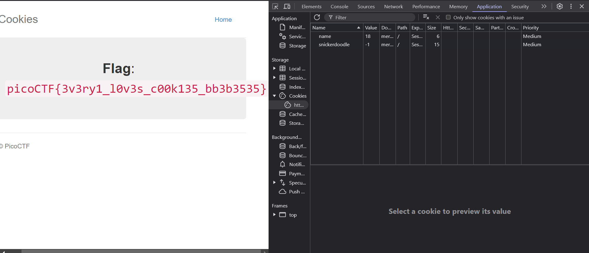

# SOAP

**Flag:** `flag`

How you approached the challenge:

- step 1

```
code
```

- step 2

```
terminal output
```

- etc.



What you learned through solving this challenge:

1. first concept
2. second concept
3. etc.

Other incorrect methods you tried:

- a
- b
- c

References

- reference 1
- reference 2
- etc.


# Challenge name

**Flag:** `flag`

How you approached the challenge:

- step 1

```
code
```

- step 2

```
terminal output
```

- etc.


What you learned through solving this challenge:

1. first concept
2. second concept
3. etc.

Other incorrect methods you tried:

- a
- b
- c

References

- reference 1
- reference 2
- etc.


# cookies

**Flag:** `picoCTF{3v3ry1_l0v3s_c00k135_bb3b3535}`

How I approached the challenge:
- Step 1: 
On opening the website and considering the name of the challenge _cookies_, it pointed to looking at the cookies of the website

- Step 2: 
Open the "Inspect element" tab (also known as the developer tools) using ` Ctrl + Shift + I ` and head to the ` Application ` tab

- Step 3: 
Looking at the cookie data, I noticed a pre defined cookie call `name` with a value of `-1`

- Step 4: 
Looking at the already given name for the cookie ptompt as "snickerdoodle", I put it into to input field and realised that the `name ` cookie had its value updated to `0`. </br>  </br> **BINGO**

- Step 5: 
Increment the value of the `name` cookie by 1 to see how the output changes
2: Oatmeal raisin
3: gingersnap
4: shortbread
5: peanut butter cookies
6: whoopie pie cookies
7: sugar 
8: molasses cookies
and so on

This went on upto value of 18 where it gave the flag


What you learned through solving this challenge:

1. first concept
2. second concept
3. etc.

Other incorrect methods you tried:

- a
- b
- c

References

- reference 1
- reference 2
- etc.
